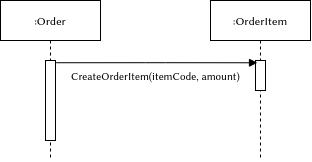

# Creator Pattern

* Problem
    * "Who" should be responsible for creation of class instances?
* Solution
    * Assign responsibility of class A instances creation to class B.
* Recommendations
    * It is reasonable to use this pattern if class B contains,
      aggregates, actively uses objects of class A.

# Pros and Cons

* Pros
    * Using this pattern is not increase coupling, because created
      class is visible only for creator class.
* Cons
    * If the procedure of object creation is complex (for example,
      it is done basing on some external condition), then it is more
      appropriate to use "Abstract Factory" pattern, i.e. delegate
      object creation responsibility to special classes.
