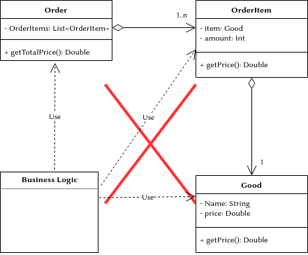

# Information Expert Pattern

* Problem
    * Only necessary information should be accumulated, processed, etc.
      in the system.
* Solution
    * Assign responsibility of accumulating, processing, etc., of information
      to some specific class (information expert), which will have all
      needed data.
* Recommendations
    * Not only one class can be information expert. There can be several
      classes.

In simple words: There should be only one 'dot' when addressing entity
properties. The following is the violation of the Information Expert pattern:
`entity.subentity.subsubentity.doSomething()`

